# HomeReader Documentation

## Nicole Hulett T3A1-Part A

[GitHub Repository](https://github.com/HomeReaderApp/HomeReaderDocs)

[Video presentation of Application](https://vimeo.com/843611257/a16c99ae75)

# Table of contents
- [Description](https://github.com/HomeReaderApp/HomeReaderDocs#Description)
- [Purpose](https://github.com/HomeReaderApp/HomeReaderDocs#Purpose)
- [Functionality/Features](https://github.com/HomeReaderApp/HomeReaderDocs#Functionality--Features)
- [Target Audience](https://github.com/HomeReaderApp/HomeReaderDocs#Target-Audience)
- [Tech Stack](https://github.com/HomeReaderApp/HomeReaderDocs#Tech-Stack)
- [Application Architecture](https://github.com/HomeReaderApp/HomeReaderDocs#Application-Architecture)
- [Dataflow diagram](https://github.com/HomeReaderApp/HomeReaderDocs#Dataflow-Diagram)
- [User stories](https://github.com/HomeReaderApp/HomeReaderDocs#User-Stories)
- [Wireframes](https://github.com/HomeReaderApp/HomeReaderDocs#Wireframes)
- [Trello Board](https://github.com/HomeReaderApp/HomeReaderDocs#Trello-Board)

# Description 

# Purpose
The main purpose of the HomeReader application is to provide a tool to support teachers and parents in communicating a child’s home reading progress. Many schools today continue to use a hard copy book to log all the home reading a student does. This is not environmentally friendly, or supportive of parents that are already time poor. HomeReader aims to replace the need for the old style home reading log and provide more accurate and accessible information to teachers by students or parents (depending on age of child) logging their home reading each night on the app. 

# Functionality/Features
-	Separate login pages for teachers and students/parents
-	An easy to fill in form for students/parents to log their home reading
-	A teacher portal where a teacher can quickly navigate to the information they want to view
-	Ability for teachers to create more than one class and add students to each class
-	Teachers can provide an easy, but unique login code for each of their students
-	A page for teachers to see the highest rated books that their students have been reading
-	A page for teachers to see a list of the students in a class with easy functionality to update or delete students
-	An individual profile page that gives all the latest reading information on a specified student
-	A page where teachers can view any comments that parents/students are making

# Target Audience
The HomeReader application is targeted at teachers, parents and students. Teachers are the main audience, as they will be the users that control how the application is used by their students. Registered teachers also have access to the most information through the teacher portal. Parents will utilize the application to log their child’s home reading or assist this process depending on the age and ability of their child. The application is also targeted at students to log their home reading every day. HomeReader provides an easy to login and use interface to ensure the process can be done quickly and easily by students. 

# Tech Stack
**Front-end**
- HTML
- JavaScript
- CSS
- React

**Back-end**
- Express
- Node.js

**Database**
- MongoDB
- Mongoose

**Deployment**
- Netlify (Front-end)
- Heroku (Back-end)

**Project Management Tools**
- Trello

**Testing**
- Jest
- React testing library

**DevOps Tools**
- Git
- GitHub
- Visual Studio Code

**Design Tools**
- Figma
- Draw.io

# Application Architecture Diagram

# Dataflow Diagram

Click [here](docs/DataflowDiagram.drawio.pdf) for a closer inspection of the below diagram.

# User Stories

### Teacher User

The first user of this application is a ‘Teacher’ in a primary school setting. However, this app could also potentially be used in secondary schools or special education settings as well. The ‘Teacher’ user is a user that is responsible for a class of students that encourage home reading every day. 

-	As a teacher, I want to be able to register and login securely to ensure I protect the school home reading data of students.
-	As a teacher, I want to be able to create my own class and give it an identifiable name.
-	As a teacher, I want to be able to add students to my class with a first and last name and a school year level.
-	As a teacher, I want to be able to give all my students a unique login code that they can use to login to a page to record their home reading.
-	As a teacher, I want to be able to view a list of the students in my class.
-	As a teacher, I want to be able to delete a student from the class list if a student leaves the class or the school.
-	As a teacher, I want to be able to view a list of books each of my students has read.
-	As a teacher, I want to find out how many nights each of my students has read.
-	As a teacher, I want to view a list of books that have a high rating from the students.
-	As a teacher, I want to view a list of any comments the students have submitted from their reading.

### Parent/Student user

The second user of this planned HomeReader App is a parent or student. These users are considered here as the same type of as user as what they want to be able to achieve is exactly the same. In a Primary school, students in lower grades do not yet have the ability to effectively use technology and record the appropriate information, therefore parents would need to be the user in this case and input the information. However, older primary school students are quite capable of recording their own home reading without the assistance of a parent. Therefore, they would still be using the app the exact same way as any parent user and for the same purpose.

-	As a parent/student, I want to be able to login easily to the HomeReader form page.
-	As a parent/student, I want to be able to input the title of the book read by the student, a rating of the book and a comment about the student’s reading.
-	As a parent/student, I want to be able to submit the form and get confirmation that it has been sent to the teacher.

### Modifications to user stories:

#### Teacher 

After discussion with a variety of teachers, young and old, the following user stories were created. Most teachers indicated that they would be logging in and accessing the application from a computer or tablet. 

-	As a teacher, I want to be able to access the information quickly.
-	As a teacher, I want the page to be easy to navigate.
-	As a teacher, I want to be able to reset my password if I forget it.
-	As a teacher, I want to be able to edit/update my students details or login codes.

#### Parent/Student

After discussion with parents and students at my current school, the following user stories need to be considered. Most of the below are to do with design and layout aspects of the application. Also, most students/parents indicated that they would access app on a mobile or tablet device.

-	As a parent/student, I want a simple and easy to remember login code.
-	As a parent/student, I want the page to record reading details to be uncluttered and easy to read.
-	As a parent/student, I want a calm screen view as students often read just before bed and record their results then.
-	As a parent/student I want the application to be easily accessible and viewable on a mobile or tablet device as well as a computer screen. 

# Wireframes

## Landing Page
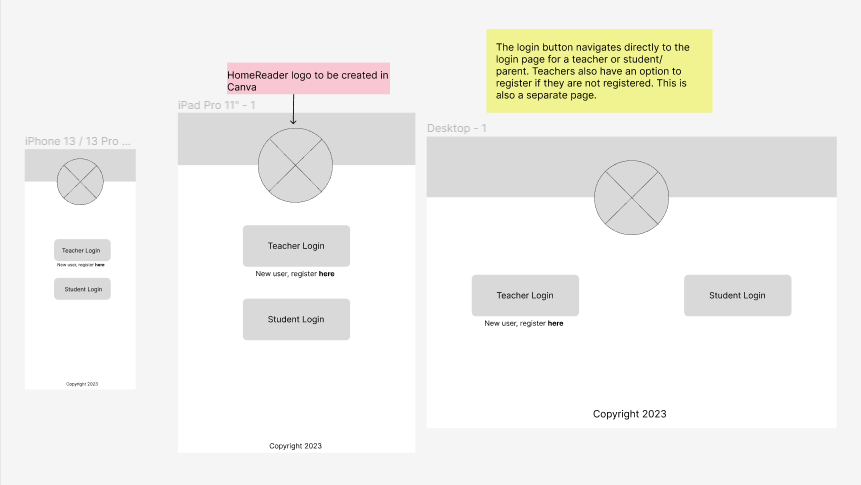
## Teacher Login
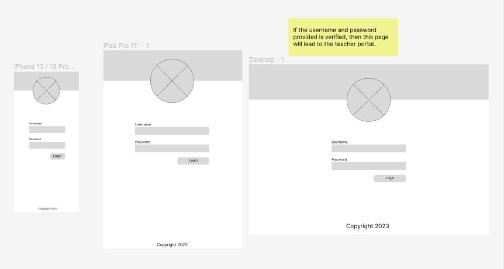
## Teacher Register
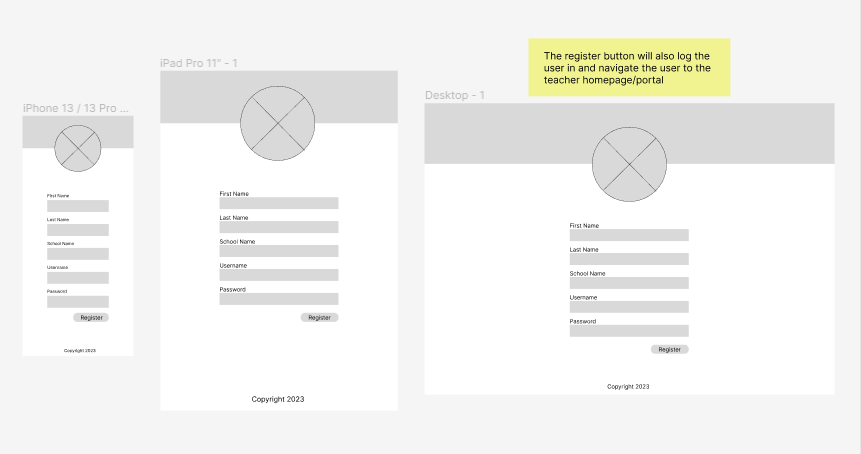
## Teacher Portal

## Student Login

## Student reading form

## Classes
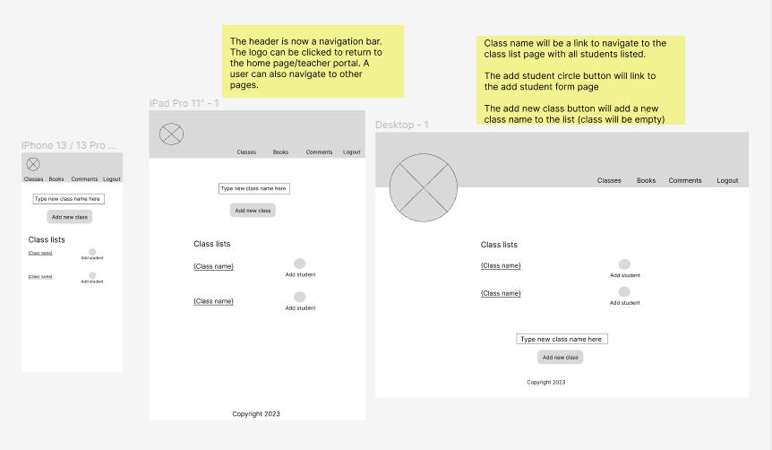
## Class list
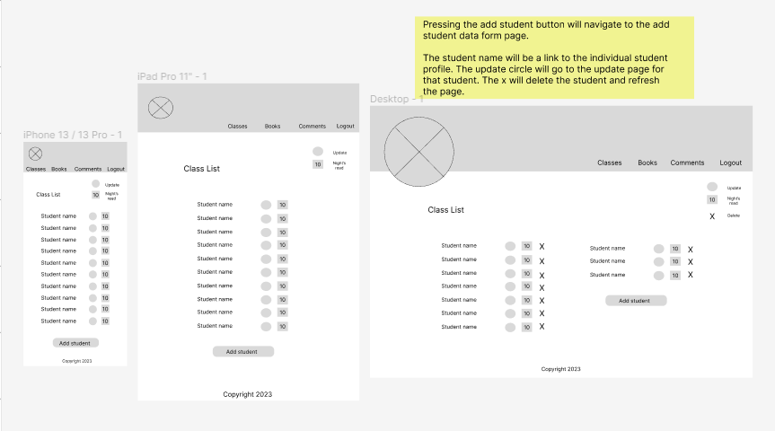
## Add Student

## Edit Student
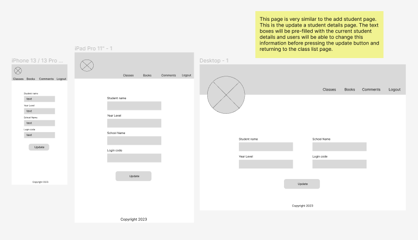
## Student profile

## Favourite books
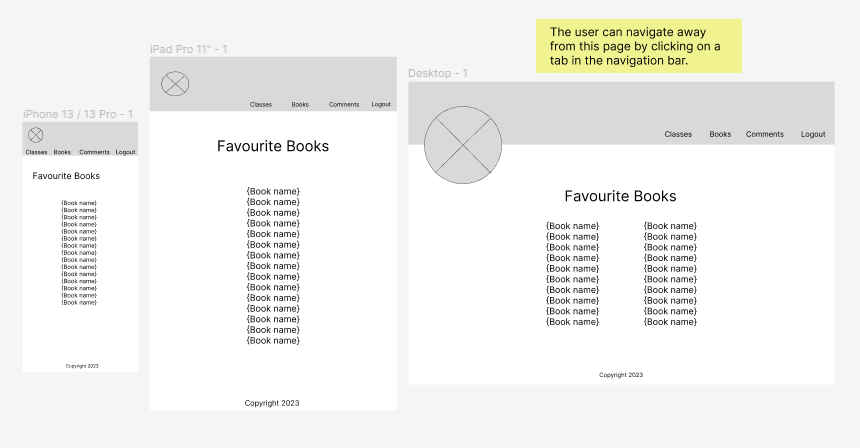
## Comments
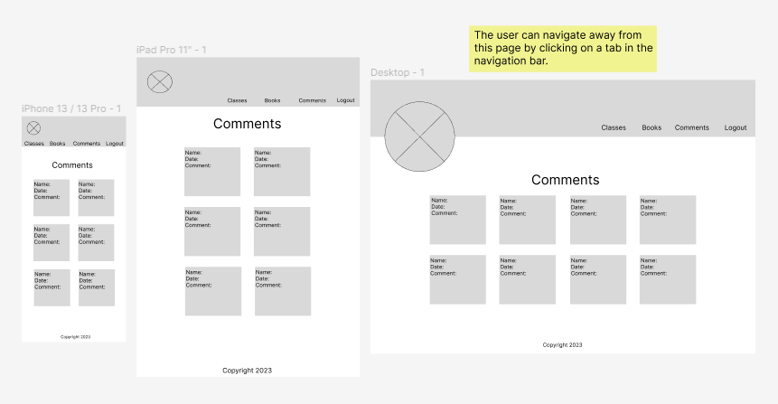

# Trello Board

My Trello board can be viewed [here](https://trello.com/b/vsvw5sQt/home-reader-app).

After further research on Trello. I updated how I was using labels and custom fields. My labels indicate the amount of work required for each card in regards to how small or big it is. The custom fields tag state what part of the application that card is related to.

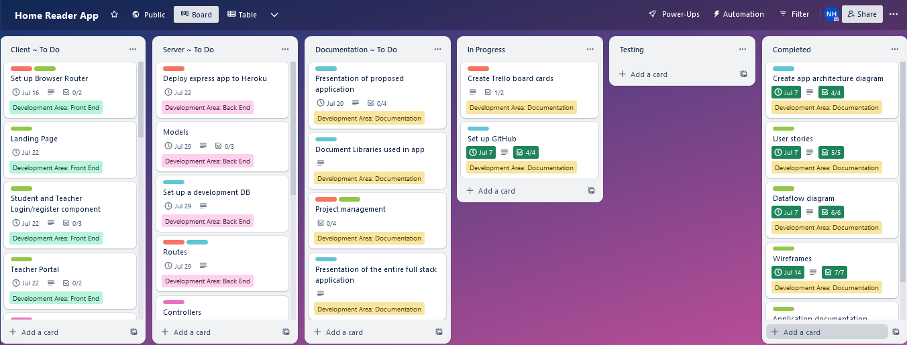
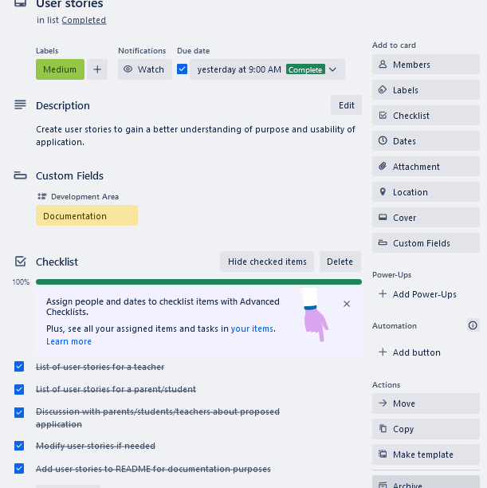
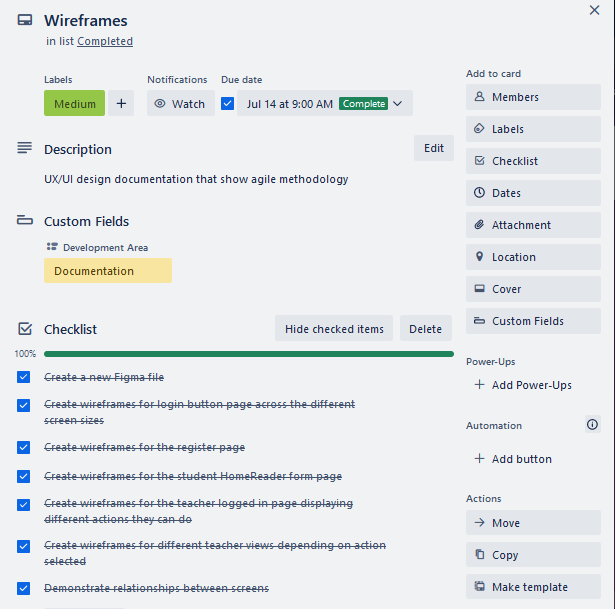
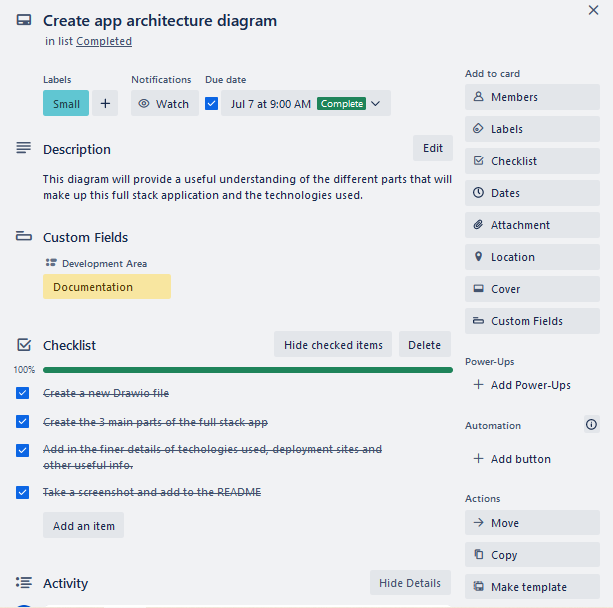
